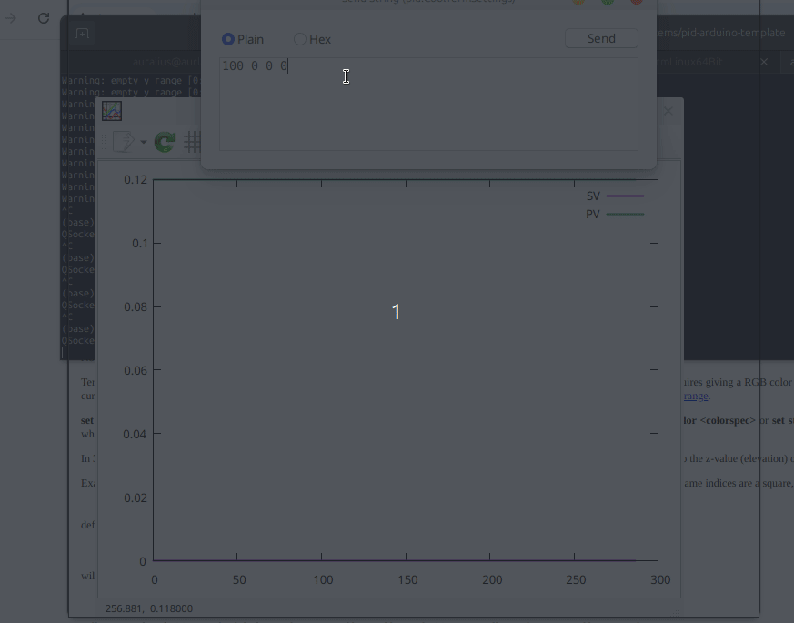

This repository contains a template for implementing a PID control in an Arduino Uno.

As an example, we use a cheap N20 DC motor that is already equipped with a quadrature encoder.

To drive the motor, we use a Arduino Motor Shiled rev 3. The complete system is as follows:

To avoid recompiling the codes every time we tune the controller, we propose the following input configuration:

To log and plot the motor data, we use CoolTerm and gnuplot. The logged data format is as follows:

The following GIF animation shows that the implemented controller works. Currently, only the P-control has been implemented in this repository.

